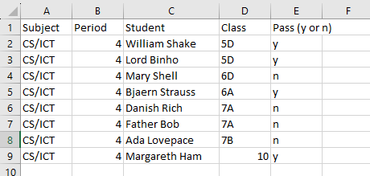
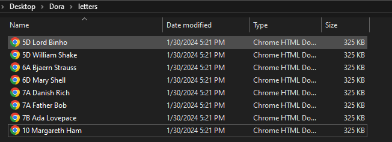

# Dora

## About
A Go program to write letters to parents giving notice about the students' academic performance. The project was created to ease writing letters for the school faculty. The name was inspired by Fernanda Montenegro's character in the movie Central do Brasil. Dora uses Maroto PDF to simplify dealing with document processing and formatting.

## Installation and how to use
- Download the project as a zip file and extract it.
- Fill the students' data in the CSV file in the data folder. You can also create a Google Spreadsheet following the same formatting and download it as a CSV. Then, place it in the data folder.

  
- Click on the Dora executable file. You will find the letters in the letters directory.
  

